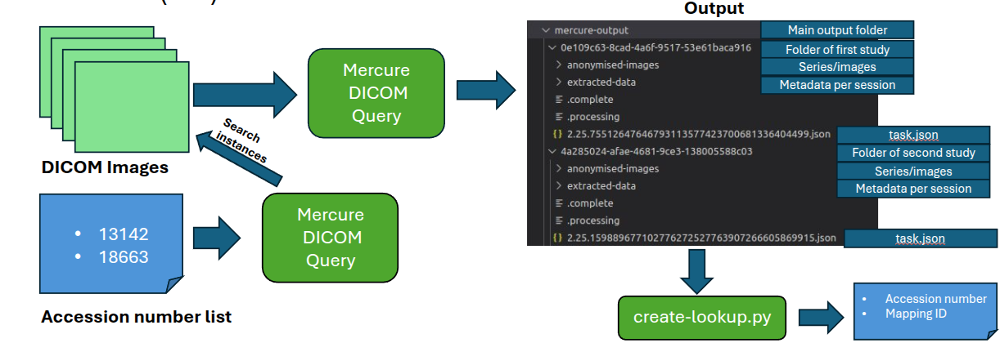

# Anonymisation and Extraction Module using Mercure

# Mercure pipeline

Here is the documentation for running the Mercure pipeline for running locally.

## Purpose

This module pick DICOM images and anonymised them using **https://pypi.org/project/dicom-anonymizer/**. After the anonimisation is done, the main DICOM tags as stored in a JSON file per each series. Besides that, a task.json file is generated to keep the main information of the input series and the process done with mercure. 

The structure of the output is illustrated below:
```
.
├── Study1 (newUID)/
│   ├── anomyised-images/
│   │   ├── Series1 (SeriesDescription)
|   |   |   ├──  image1.dcm (InstanceNumber)
|   |   |   ├──  image2.dcm
|   |   |   └──  imagen.dcm 
|   |   └── Series2 
|   |       ├──  image1.dcm
|   |       └──  image2.dcm
│   ├── extracted-data/
│   │   ├── Series1.json
|   |   └── Series2.json
|   └── task.json (newStudyID)
└── Study2...
```

## Requirements

* Docker
* Git
## Installation Steps

These steps are suitable to run in Linux. If you are working in a computer with Windows, please refer to the steps defined in the bottom of this readme.

1) Clone the mercure repository: 

```bash
git clone https://github.com/mercure-imaging/mercure.git
```

2) Install Mercure using Docker by pulling docker images and run containers. 
```bash
sudo ./install.sh docker
```
At the end of the installation, **mercureimaging** Docker images should be donwloaded. 
Mercure is using several containers for all the modules. Also a directory in **/opt/mercure/data/** is created. It's suggested to create a folder **mercure-output** in **/opt/mercure** by running:

```bash
sudo mkdir /opt/mercure/data/mercure-output
sudo chmod 777 /opt/mercure/data/mercure-output

```

In that way, all the output will be leaved there. Other directory might be used, but you need to define carefully all the permissions required.

3) Access to Mercure app. Default user: admin, pass: router.
```
http://127.0.0.1:8000/
```

4) Create docker image

 To create the Docker image, the next lines should be run:

```bash
# Clone this repository
git clone https://github.com/victorcaquilpan/mercure-extraction-anonymisation.git
cd extraction-module
sudo make build
# Check image
sudo docker images
# You should see aiml/extraction-anonymisation
```

## Setting up Mercure 

1) At Mercure, in **Modules** we need to add our module by selecting the Docker image:
* Name of module: extraction
* Docker tag: **aiml/extraction-anonymisation**
* Module type: mercure

2) In **Targets**, we need to add a two targets. Data source (PACS) and output (folder).

**PACS (Input)**:

* Type: DICOM
* Capability: Both
* Host/IP: 172.19.0.1        # Provide IP
* Port: 4242                 # Provide Port
* AET Target: orthanc        # Provide AET 
* Pass Incoming value: Yes
* AET Source: mercure
* Pass Incoming value: Yes

**Folder (Output)**:

* Type: Folder
* Name of the target: local
* Folder: /opt/mercure/data/mercure-output
* Exclusion filter: task.json

After the target are created, test it to check whether they are reachable.

3) In **Rules**, we need to add a new rule, defining the pipeline and the input target:

* Name of the rule: extraction-mri
* Selection rule: For our demo, we are using **tags.Modality == "MR"**. Any rule using the DICOM tags can be used. Use **True** if you can to apply the rule to any new image.
* Action: Processing & Routing
* Trigger: Completed Study
* Completion condition: Timeout Reached
* In Processing tab: Select **extraction** module. 
* In Routing tab: Select **local**.

## Testing

We can test sending data by using [DCMTK Tools](https://dicom.offis.de/en/dcmtk/dcmtk-tools/):

```bash
sudo apt install dcmtk
dcmsend 172.19.0.1 11112 --scan-directories --recurse Pseudo-PHI-DICOM-Data
```

Or also using Orthanc, following the [Docker Compose installation steps](https://orthanc.uclouvain.be/book/users/docker.html#docker). 

In a folder **orthanc**, create **docker-compose.yml** with the next content:
```bash
version: '3.1'  # Secrets are only available since this version of Docker Compose
services:
  orthanc:
    image: jodogne/orthanc-plugins:1.12.10
    command: /run/secrets/  # Path to the configuration files (stored as secrets)
    ports:
      - 4242:4242
      - 8042:8042
    secrets:
      - orthanc.json
    environment:
      - ORTHANC_NAME=HelloWorld
secrets:
  orthanc.json:
    file: orthanc.json
```
Also, create an **orthanc.json** file where you need to define the connection with mercure.

```bash
{
  "Name": "${ORTHANC_NAME} in Docker Compose",
  "RemoteAccessAllowed": true,

  "DicomModalities": {
    "mercure-target": [ "mercure", "172.19.0.1", 11112 ]
  }
}
```

Now, create the container by running: 
```bash
sudo docker-compose up -d
```

and to access to the web app, you can go to http://localhost:8042/. Pseudo-data might be uploded to Orthanc using:

```bash
sudo dcmsend 172.19.0.1 4242 --scan-directories --recurse Pseudo-PHI-DICOM-Data
```

## Making DICOM Queries

We can look for DICOM series using Accession Numbers and also filtering by Study Descriptions and Series Descriptions. Orthanc allows to run the pipeline straight away to these images. The output folder be available at **/opt/mercure/data/mercure-output**, where each study go to a new folder whose name is a random number.

This is what you see in the app:


This is what you would see locally:


The structure of the output is defined by:

* **main output folder**: This is a main directory where the data is stored. Located at **/opt/mercure/data/mercure-output**.
* **study folder**: Filename is assigned randomly.
* **anonymised-images**: it contains one folder per session and in each one, there will be available the images. The filename is the instance number.
* **extracted-data folder**: It contains the DICOM tags of the first DICOM image for that session. Personal information is removed.
* **task.json file**: Filename is based on the studyID. It contains the pipeline process performed, the sessions and the accession number.
* **.complete** and **.processing** are just placeholders to confirm the preprocessing was completed. mercure create them by default.

You can find the output of this demo in the **sample-output** folder.


### Notes

* They go to provide to me access to a machine, where I can run mercure. They go to provide a VPN to connect.
* For mercure, I need to remove the PatientName from the output. **Done**.
* Remove the worksheets (in the cases where a document is stored in the middle of the DICOM images). **Need a sample to test**
* Provide a lookup table. **Easily, we can create a look-up table from the task.json files stored in each study, as they keep the accession number**. I have created a script to build the lookup table.y
* The JSON files should have the data of the anonymised images. **Done**
* Use studyID as name for the task.Json file: **Done**

### Full Workflow





### Installation in Windows ?

We need to install Docker. For that we can install Docker Desktop and create the Docker image **extraction**.

To run an instance in a virtual machine (VM), you need to:

* Install [VirtualBox](https://www.virtualbox.org/)
* Install [Vagrant](https://developer.hashicorp.com/vagrant)
* Install [Git](https://git-scm.com/install/windows)

Install vagrants plugins by running the next command in **Windows Command Prompt** (cmd):

```bash
vagrant plugin install vagrant-disksize
```
and follow the steps given by mercure to install the VM with mercure. These commands also should run in **cmd**.

```bash
git clone --branch latest-stable https://github.com/mercure-imaging/mercure.git
# And run vagrant
cd mercure/addons/vagrant/systemd
vagrant up
```

In case the port 8000 is already under use, that would be forwarded. In the test, the port 8000 (VM) was forwarded to 2200. Then, to access to mercure, we need to search in the browser:

```bash
http://localhost:2200/
```

Some notes:

* To access by SSH to the VM, you need to stay at **mercure/addons/vagrant/systemd** and type **vagrant ssh** in the cmd, command which allows to access straight to the VM.
* Need to create manually, the folder **mercure-output** in **/opt/mercure/data** directory and make the folder writable by using:

```bash
# Inside the VM, you can go to /opt/mercure/
cd /opt/mercure/
make mercure-output
sudo chmod 777 mercure-output/
```

Now, you need to follow the steps defined previously from the point **4. Installation Steps** to create the Docker image. After that, follow the regular steps defined in **Setting up Mercure**. 


The easiest way to test mercure is sending data with [DCMTK Tools](https://dicom.offis.de/en/dcmtk/dcmtk-tools/):

```bash
dcmsend 127.0.0.1 --scan-directories --recurse Pseudo-PHI-DICOM-Data
```

The pipeline process will be running in the background and all the output be stored at **mercure-output** folder. This process can take 5-10 minutes to generate the first results. After that easily you can copy or move the output files to the shared volume **/vagrant**. Everything there is available by the VM and the Windows machine.